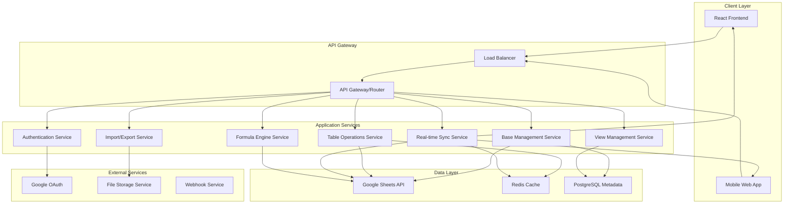

# Design Document

## Overview

The Airtable clone will be built as a modern web application using a microservices architecture with Google Sheets as the primary data storage backend. The system will provide real-time collaboration, multiple view types, and advanced data manipulation capabilities while maintaining high performance and scalability.

The application will consist of a React-based frontend, a Node.js backend API, real-time synchronization services, and integration layers for Google Sheets API. The architecture prioritizes modularity, testability, and production readiness.

## Architecture

### High-Level Architecture



### Technology Stack

**Frontend:**
- React 18 with TypeScript
- Redux Toolkit for state management
- React Query for server state management
- Material-UI or Ant Design for component library
- Socket.io-client for real-time updates
- React Virtual for performance optimization

**Backend:**
- Node.js with Express.js
- TypeScript for type safety
- Socket.io for real-time communication
- Bull Queue for background job processing
- Jest for testing

**Data Storage:**
- Google Sheets API as primary data store
- PostgreSQL for metadata, user preferences, and view configurations
- Redis for caching and session management

**Infrastructure:**
- Docker containers for deployment
- Nginx for load balancing and static file serving
- PM2 for process management
- Google Cloud Platform or AWS for hosting

## Components and Interfaces

### Frontend Components

#### Core Components
```typescript
// Base component hierarchy
interface BaseComponent {
  id: string;
  name: string;
  description?: string;
  createdAt: Date;
  updatedAt: Date;
}

interface TableComponent extends BaseComponent {
  fields: Field[];
  records: Record[];
  views: View[];
}

interface ViewComponent {
  id: string;
  name: string;
  type: 'grid' | 'kanban' | 'calendar' | 'gallery';
  filters: Filter[];
  sorts: Sort[];
  fieldVisibility: FieldVisibility;
}
```

#### View Components
- **GridView**: Spreadsheet-like table with virtual scrolling
- **KanbanView**: Card-based board with drag-and-drop
- **CalendarView**: Calendar interface with date field integration
- **GalleryView**: Card gallery with image previews

#### Shared Components
- **FieldEditor**: Dynamic field type editor with validation
- **FilterBuilder**: Visual filter construction interface
- **FormulaEditor**: Code editor with syntax highlighting and autocomplete
- **CollaborationIndicators**: Real-time user presence and cursors

### Backend Services

#### Authentication Service
```typescript
interface AuthService {
  authenticateUser(token: string): Promise<User>;
  authorizeAccess(userId: string, baseId: string): Promise<Permission>;
  generateApiKey(userId: string): Promise<string>;
  validateApiKey(apiKey: string): Promise<User>;
}
```

#### Base Management Service
```typescript
interface BaseService {
  createBase(userId: string, baseData: CreateBaseRequest): Promise<Base>;
  getBase(baseId: string): Promise<Base>;
  updateBase(baseId: string, updates: UpdateBaseRequest): Promise<Base>;
  deleteBase(baseId: string): Promise<void>;
  shareBase(baseId: string, shareConfig: ShareConfig): Promise<void>;
}
```

#### Table Operations Service
```typescript
interface TableService {
  createTable(baseId: string, tableData: CreateTableRequest): Promise<Table>;
  getRecords(tableId: string, query: QueryParams): Promise<RecordSet>;
  createRecord(tableId: string, recordData: RecordData): Promise<Record>;
  updateRecord(recordId: string, updates: RecordData): Promise<Record>;
  deleteRecord(recordId: string): Promise<void>;
  bulkOperations(operations: BulkOperation[]): Promise<BulkResult>;
}
```

#### Real-time Sync Service
```typescript
interface SyncService {
  subscribeToTable(tableId: string, socketId: string): void;
  broadcastChange(tableId: string, change: ChangeEvent): void;
  handleGoogleSheetsWebhook(payload: WebhookPayload): void;
  syncFromGoogleSheets(tableId: string): Promise<SyncResult>;
  syncToGoogleSheets(tableId: string, changes: Change[]): Promise<void>;
}
```

### Google Sheets Integration Layer

#### Sheets API Wrapper
```typescript
interface SheetsApiWrapper {
  createSpreadsheet(title: string): Promise<string>;
  createSheet(spreadsheetId: string, title: string): Promise<number>;
  batchUpdate(spreadsheetId: string, requests: BatchUpdateRequest[]): Promise<void>;
  getValues(spreadsheetId: string, range: string): Promise<any[][]>;
  updateValues(spreadsheetId: string, range: string, values: any[][]): Promise<void>;
  appendValues(spreadsheetId: string, range: string, values: any[][]): Promise<void>;
}
```

## Data Models

### Core Data Models

#### Base Model
```typescript
interface Base {
  id: string;
  name: string;
  description?: string;
  googleSheetsId: string;
  ownerId: string;
  collaborators: Collaborator[];
  tables: Table[];
  createdAt: Date;
  updatedAt: Date;
}
```

#### Table Model
```typescript
interface Table {
  id: string;
  baseId: string;
  name: string;
  googleSheetId: number;
  fields: Field[];
  views: View[];
  recordCount: number;
  createdAt: Date;
  updatedAt: Date;
}
```

#### Field Model
```typescript
interface Field {
  id: string;
  tableId: string;
  name: string;
  type: FieldType;
  options: FieldOptions;
  required: boolean;
  columnIndex: number;
  createdAt: Date;
  updatedAt: Date;
}

type FieldType = 
  | 'text'
  | 'number'
  | 'singleSelect'
  | 'multiSelect'
  | 'date'
  | 'checkbox'
  | 'attachment'
  | 'formula'
  | 'lookup'
  | 'rollup'
  | 'link';
```

#### Record Model
```typescript
interface Record {
  id: string;
  tableId: string;
  rowIndex: number;
  fields: { [fieldId: string]: any };
  createdAt: Date;
  updatedAt: Date;
  createdBy: string;
  lastModifiedBy: string;
}
```

### View Configuration Models

#### View Model
```typescript
interface View {
  id: string;
  tableId: string;
  name: string;
  type: ViewType;
  configuration: ViewConfiguration;
  filters: Filter[];
  sorts: Sort[];
  fieldVisibility: { [fieldId: string]: boolean };
  createdAt: Date;
  updatedAt: Date;
}

interface ViewConfiguration {
  // Grid view specific
  frozenColumns?: number;
  rowHeight?: 'short' | 'medium' | 'tall';
  
  // Kanban view specific
  groupByField?: string;
  cardFields?: string[];
  
  // Calendar view specific
  dateField?: string;
  colorField?: string;
  
  // Gallery view specific
  imageField?: string;
  titleField?: string;
}
```

### Collaboration Models

#### User Presence Model
```typescript
interface UserPresence {
  userId: string;
  userName: string;
  avatar?: string;
  currentView: string;
  cursor?: {
    recordId: string;
    fieldId: string;
  };
  selection?: {
    startRecord: string;
    endRecord: string;
    startField: string;
    endField: string;
  };
  lastSeen: Date;
}
```

## Error Handling

### Error Classification

#### Client Errors (4xx)
- **ValidationError**: Invalid input data or field constraints
- **AuthenticationError**: Invalid credentials or expired tokens
- **AuthorizationError**: Insufficient permissions for requested operation
- **NotFoundError**: Requested resource does not exist
- **ConflictError**: Concurrent modification conflicts

#### Server Errors (5xx)
- **GoogleSheetsApiError**: Google Sheets API failures or rate limiting
- **DatabaseError**: PostgreSQL or Redis connection/query failures
- **SyncError**: Real-time synchronization failures
- **FormulaError**: Formula calculation or parsing errors

### Error Handling Strategy

```typescript
interface ErrorHandler {
  handleClientError(error: ClientError): ErrorResponse;
  handleServerError(error: ServerError): ErrorResponse;
  handleGoogleSheetsError(error: GoogleSheetsError): ErrorResponse;
  retryWithBackoff<T>(operation: () => Promise<T>, maxRetries: number): Promise<T>;
}

interface ErrorResponse {
  code: string;
  message: string;
  details?: any;
  retryable: boolean;
  retryAfter?: number;
}
```

### Resilience Patterns

1. **Circuit Breaker**: Prevent cascading failures when Google Sheets API is unavailable
2. **Retry with Exponential Backoff**: Handle transient failures gracefully
3. **Graceful Degradation**: Provide read-only mode when sync services are down
4. **Optimistic Updates**: Update UI immediately, rollback on failure
5. **Conflict Resolution**: Last-write-wins with user notification for conflicts

## Testing Strategy

### Frontend Testing

#### Unit Testing
- Component testing with React Testing Library
- Redux reducer and action testing
- Utility function testing with Jest
- Formula parser and validator testing

#### Integration Testing
- API integration testing with Mock Service Worker
- Real-time synchronization testing
- Cross-browser compatibility testing
- Accessibility testing with axe-core

#### End-to-End Testing
- Critical user journeys with Playwright
- Multi-user collaboration scenarios
- Performance testing under load
- Mobile responsiveness testing

### Backend Testing

#### Unit Testing
- Service layer testing with Jest
- Google Sheets API wrapper testing with mocks
- Formula engine testing with comprehensive test cases
- Authentication and authorization testing

#### Integration Testing
- Database integration testing with test containers
- Google Sheets API integration testing
- Real-time WebSocket testing
- Cache layer testing

#### Performance Testing
- Load testing with Artillery or k6
- Google Sheets API rate limit testing
- Memory leak detection
- Database query optimization testing

### Testing Data Management

```typescript
interface TestDataManager {
  createTestBase(): Promise<Base>;
  createTestTable(baseId: string): Promise<Table>;
  seedTestData(tableId: string, recordCount: number): Promise<Record[]>;
  cleanupTestData(): Promise<void>;
}
```

### Continuous Integration

1. **Pre-commit Hooks**: Linting, type checking, and unit tests
2. **Pull Request Checks**: Full test suite, security scanning, and code coverage
3. **Staging Deployment**: Automated deployment for integration testing
4. **Production Deployment**: Blue-green deployment with rollback capability

## Performance Optimization

### Frontend Optimization

1. **Virtual Scrolling**: Handle large datasets efficiently
2. **Memoization**: Prevent unnecessary re-renders
3. **Code Splitting**: Lazy load view components
4. **Caching**: Cache computed values and API responses
5. **Debouncing**: Optimize search and filter operations

### Backend Optimization

1. **Connection Pooling**: Efficient database connections
2. **Query Optimization**: Minimize Google Sheets API calls
3. **Caching Strategy**: Multi-layer caching with Redis
4. **Background Processing**: Async operations with job queues
5. **Rate Limiting**: Respect Google Sheets API limits

### Data Synchronization Optimization

```typescript
interface SyncOptimizer {
  batchOperations(operations: Operation[]): BatchedOperation[];
  calculateDelta(oldData: any[], newData: any[]): Delta;
  compressPayload(data: any): CompressedData;
  prioritizeUpdates(updates: Update[]): PrioritizedUpdate[];
}
```

This design provides a solid foundation for building a production-ready Airtable clone with Google Sheets integration, focusing on scalability, maintainability, and user experience.